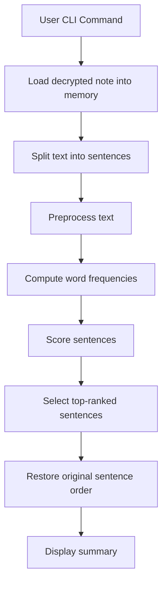

```mermaid
flowchart TD
    A[User CLI Command]
    B[Load decrypted note into memory]
    C[Split text into sentences]
    D[Preprocess text]
    E[Compute word frequencies]
    F[Score sentences]
    G[Select top-ranked sentences]
    H[Restore original sentence order]
    I[Display summary]

    A --> B --> C --> D --> E --> F --> G --> H --> I
```
