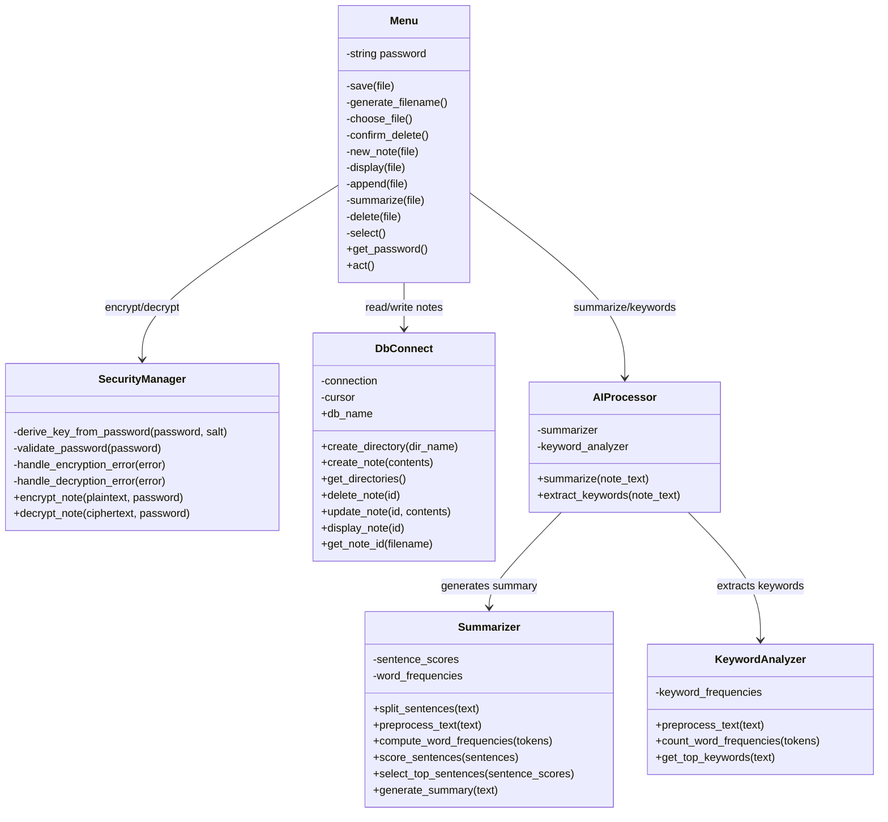

```mermaid
classDiagram
    class Menu {
        -string password
        -save(file)
        -generate_filename()
        -choose_file()
        -confirm_delete()
        -new_note(file)
        -display(file)
        -append(file)
        -summarize(file)
        -delete(file)
        -select()
        +get_password()
        +act()
    }

    class SecurityManager {
        -derive_key_from_password(password, salt)
        -validate_password(password)
        -handle_encryption_error(error)
        -handle_decryption_error(error)
        +encrypt_note(plaintext, password)
        +decrypt_note(ciphertext, password)
    }

    class DbConnect {
        -connection
        -cursor
        +db_name
        +create_directory(dir_name)
        +create_note(contents)
        +get_directories()
        +delete_note(id)
        +update_note(id, contents)
        +display_note(id)
        +get_note_id(filename)
    }

    class AIProcessor {
        -summarizer
        -keyword_analyzer
        +summarize(note_text)
        +extract_keywords(note_text)
    }

    class Summarizer {
        -sentence_scores
        -word_frequencies
        +split_sentences(text)
        +preprocess_text(text)
        +compute_word_frequencies(tokens)
        +score_sentences(sentences)
        +select_top_sentences(sentence_scores)
        +generate_summary(text)
    }

    class KeywordAnalyzer {
        -keyword_frequencies
        +preprocess_text(text)
        +count_word_frequencies(tokens)
        +get_top_keywords(text)
    }

    Menu --> SecurityManager : encrypt/decrypt
    Menu --> DbConnect : read/write notes
    Menu --> AIProcessor : summarize/keywords
    AIProcessor --> Summarizer : generates summary
    AIProcessor --> KeywordAnalyzer : extracts keywords
```
