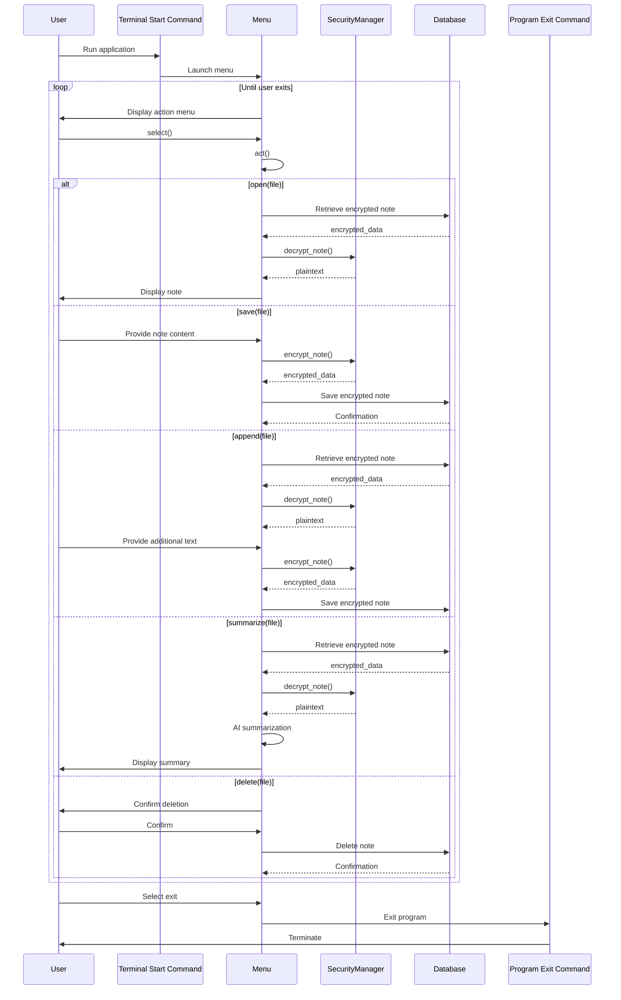

```mermaid
sequenceDiagram
    participant User
    participant TSC as Terminal Start Command
    participant Menu
    participant SecurityManager
    participant Database
    participant PEC as Program Exit Command
    
    User->>TSC: Run application
    TSC->>Menu: Launch menu
    
    loop Until user exits
        Menu->>User: Display action menu
        User->>Menu: select()
        Menu->>Menu: act()
        
        alt open(file)
            Menu->>Database: Retrieve encrypted note
            Database-->>Menu: encrypted_data
            Menu->>SecurityManager: decrypt_note()
            SecurityManager-->>Menu: plaintext
            Menu->>User: Display note
            
        else save(file)
            User->>Menu: Provide note content
            Menu->>SecurityManager: encrypt_note()
            SecurityManager-->>Menu: encrypted_data
            Menu->>Database: Save encrypted note
            Database-->>Menu: Confirmation
            
        else append(file)
            Menu->>Database: Retrieve encrypted note
            Database-->>Menu: encrypted_data
            Menu->>SecurityManager: decrypt_note()
            SecurityManager-->>Menu: plaintext
            User->>Menu: Provide additional text
            Menu->>SecurityManager: encrypt_note()
            SecurityManager-->>Menu: encrypted_data
            Menu->>Database: Save encrypted note
            
        else summarize(file)
            Menu->>Database: Retrieve encrypted note
            Database-->>Menu: encrypted_data
            Menu->>SecurityManager: decrypt_note()
            SecurityManager-->>Menu: plaintext
            Menu->>Menu: AI summarization
            Menu->>User: Display summary
            
        else delete(file)
            Menu->>User: Confirm deletion
            User->>Menu: Confirm
            Menu->>Database: Delete note
            Database-->>Menu: Confirmation
        end
    end
    
    User->>Menu: Select exit
    Menu->>PEC: Exit program
    PEC->>User: Terminate
```
