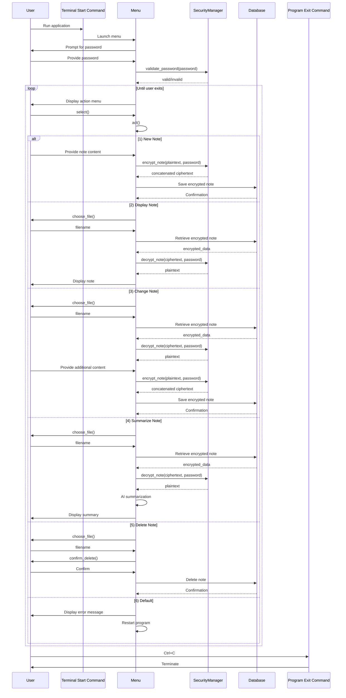

```mermaid
sequenceDiagram
    participant User
    participant TSC as Terminal Start Command
    participant Menu
    participant SecurityManager
    participant Database
    participant PEC as Program Exit Command
    
    User->>TSC: Run application
    TSC->>Menu: Launch menu
    Menu->>User: Prompt for password
    User->>Menu: Provide password
    Menu->>SecurityManager: validate_password(password)
    SecurityManager-->>Menu: valid/invalid
    
    loop Until user exits
        Menu->>User: Display action menu
        User->>Menu: select()
        Menu->>Menu: act()
        
        alt 1) New Note
            User->>Menu: Provide note content
            Menu->>SecurityManager: encrypt_note(plaintext, password)
            SecurityManager-->>Menu: concatenated ciphertext
            Menu->>Database: Save encrypted note
            Database-->>Menu: Confirmation

        else 2) Display Note
            Menu->>User: choose_file()
            User->>Menu: filename
            Menu->>Database: Retrieve encrypted note
            Database-->>Menu: encrypted_data
            Menu->>SecurityManager: decrypt_note(ciphertext, password)
            SecurityManager-->>Menu: plaintext
            Menu->>User: Display note

        else 3) Change Note
            Menu->>User: choose_file()
            User->>Menu: filename
            Menu->>Database: Retrieve encrypted note
            Database-->>Menu: encrypted_data
            Menu->>SecurityManager: decrypt_note(ciphertext, password)
            SecurityManager-->>Menu: plaintext
            User->>Menu: Provide additional content
            Menu->>SecurityManager: encrypt_note(plaintext, password)
            SecurityManager-->>Menu: concatenated ciphertext
            Menu->>Database: Save encrypted note
            Database-->>Menu: Confirmation

        else 4) Summarize Note
            Menu->>User: choose_file()
            User->>Menu: filename
            Menu->>Database: Retrieve encrypted note
            Database-->>Menu: encrypted_data
            Menu->>SecurityManager: decrypt_note(ciphertext, password)
            SecurityManager-->>Menu: plaintext
            Menu->>Menu: AI summarization
            Menu->>User: Display summary

        else 5) Delete Note
            Menu->>User: choose_file()
            User->>Menu: filename
            Menu->>User: confirm_delete()
            User->>Menu: Confirm
            Menu->>Database: Delete note
            Database-->>Menu: Confirmation

        else 6) Default
            Menu->>User: Display error message
            Menu->>Menu: Restart program
        end
    end
    
    User->>PEC: Ctrl+C
    PEC->>User: Terminate
```
