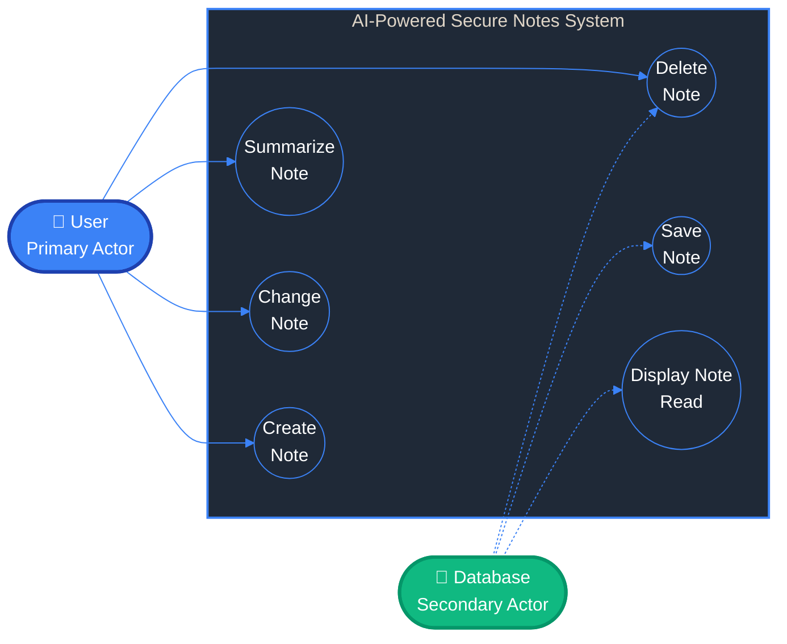

```mermaid
%%{init: {'theme':'base', 'themeVariables': { 'primaryColor':'#1f2937','primaryTextColor':'#fff','primaryBorderColor':'#3b82f6','lineColor':'#3b82f6','secondaryColor':'#374151','tertiaryColor':'#1f2937'}}}%%
graph LR
    User([👤 User<br/>Primary Actor])
    
    subgraph System[AI-Powered Secure Notes System]
        CreateNote((Create<br/>Note))
        SummarizeNote((Summarize<br/>Note))
        ChangeNote((Change<br/>Note))
        DeleteNote((Delete<br/>Note))
        SaveNote((Save<br/>Note))
        DisplayNote((Display Note<br/>Read))
    end
    
    Database([💾 Database<br/>Secondary Actor])
    
    User --> CreateNote
    User --> SummarizeNote
    User --> ChangeNote
    User --> DeleteNote
    
    Database -.-> SaveNote
    Database -.-> DisplayNote
    Database -.-> DeleteNote
    
    System ~~~ Database
    
    style User fill:#3b82f6,stroke:#1e40af,stroke-width:3px,color:#fff
    style Database fill:#10b981,stroke:#059669,stroke-width:3px,color:#fff
    style System fill:#1f2937,stroke:#3b82f6,stroke-width:2px
```
