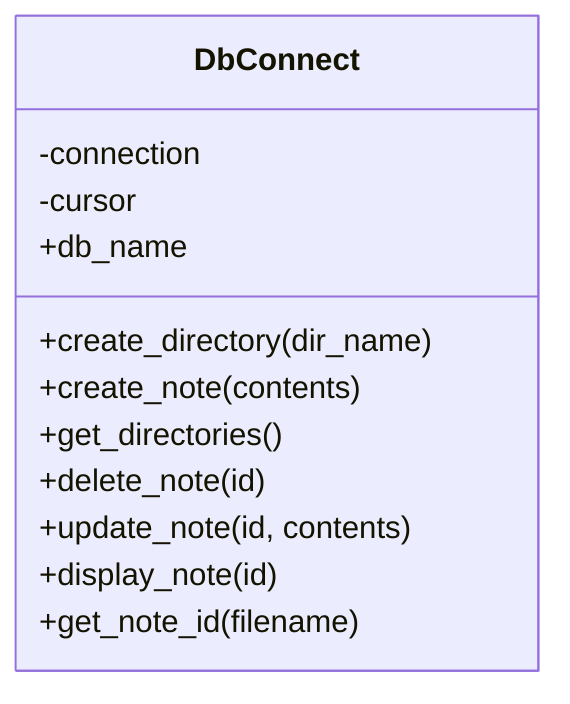

```mermaid
classDiagram


class DbConnect {
    -connection
    -cursor
    +db_name
    +create_directory(dir_name)
    +create_note(contents)
    +get_directories()
    +delete_note(id)
    +update_note(id, contents)
    +display_note(id)
    +get_note_id(filename)
}
```
