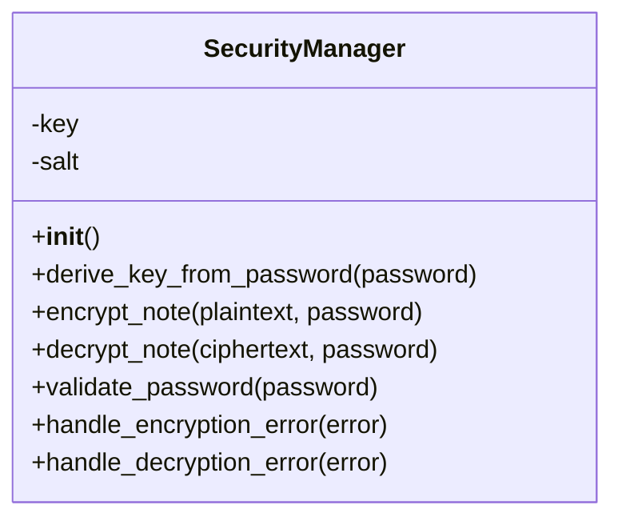

```mermaid
classDiagram
    class SecurityManager {
        -key
        -salt
        +__init__()
        +derive_key_from_password(password)
        +encrypt_note(plaintext, password)
        +decrypt_note(ciphertext, password)
        +validate_password(password)
        +handle_encryption_error(error)
        +handle_decryption_error(error)
    }
```
