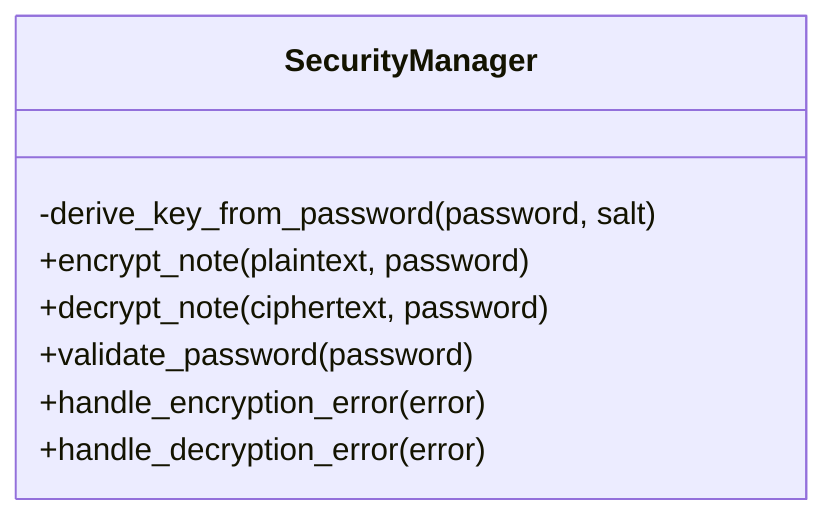

```mermaid
classDiagram
    class SecurityManager {
        -derive_key_from_password(password, salt)
        +encrypt_note(plaintext, password)
        +decrypt_note(ciphertext, password)
        +validate_password(password)
        +handle_encryption_error(error)
        +handle_decryption_error(error)
    }
```
